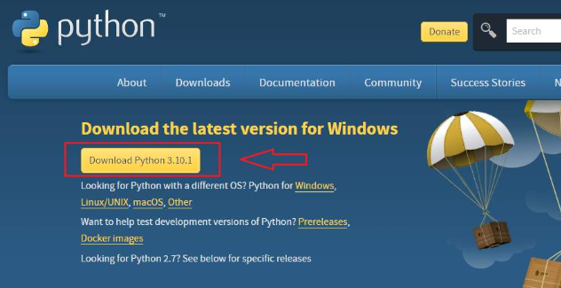
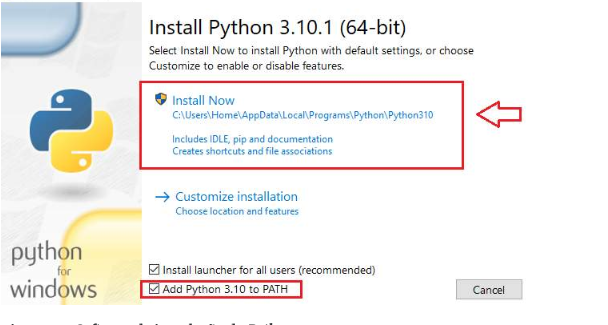

# Introdução à Linguagem Python

Python é uma linguagem de programação de alto nível interpretada, interativa, orientada a objetos. Foi criado por Guido van Rossum no final da década de 1980. Como o Perl, o código-fonte do Python também está disponível sob a GNU General Public License (GPL). Python tem seu nome inspirado um programa de TV inglês chamado “Flying Circus de Monty Python” e não na espécie de cobra.

Python é uma linguagem de programação de aplicação geral e possui uma sintaxe simples e fácil de usar. Isso torna o Python uma excelente linguagem para aprender a programar, destacamos algumas características:

- **Interpretado:** Python é processado em tempo de execução pelo interpretador. Não é preciso compilar o programa antes de executá-lo;
  
- **Orientado a objetos:** Python suporta estilo ou técnica de programação orientada a objetos que encapsula código dentro de objetos;

- **Uso geral:** Python pode ser usado para quase tudo. É aplicável a quase todos os campos para uma variedade de tarefas. Seja a execução de tarefas de curto prazo como teste de software ou desenvolvimento de software para uso ao longo prazo;

- **Fácil de aprender:** Python é extremamente fácil de começar. Python possui uma sintaxe muito simples;

- **Livre e de código aberto:** Python é um exemplo de Software Livre e Código Aberto. Em linhas gerais, você pode distribuir gratuitamente cópias deste software, ler seu código-fonte, fazer alterações nele, usar partes dele em novos programas gratuitos. Seu uso é totalmente gratuito, mesmo para fins comerciais;

- **Portátil:** Devido à sua natureza de código aberto, programas Python podem funcionar em diversas plataformas;

- **Case-sensitive:** Python diferencia letras maiúsculas de minúsculas em sua codificação;

- **Linguagem com tipagem dinâmica (Duck typing):** Em Python, não é preciso declarar o tipo de dados ao declarar uma variável. O interpretador determina o tipo de dados em tempo de execução.

## Leitura

[Duck Typing com Python](#)

Como exemplos de aplicações desenvolvidas com Python, podemos destacar:

- **Desenvolvimento Web:** Python oferece diferentes Frameworks para desenvolvimento web como Django, Pyramid, Flask. Esses Frameworks são conhecidos pela segurança, flexibilidade e escalabilidade;

- **Desenvolvimento de jogos:** PySoy e PyGame são duas bibliotecas Python usadas para desenvolvimento de jogos;

- **Inteligência Artificial e Aprendizado de Máquina:** Há um grande número de bibliotecas de código aberto que podem ser usadas durante o desenvolvimento de aplicações de Inteligência Artificial e Aprendizado de Máquina;

- **Desenvolvimento de aplicações para Desktop:** O Python possui diversos Frameworks com as quais podemos construir aplicativos de área de trabalho. PyQt, PyGtk, PyGUI são alguns exemplos.

## Leitura

[Framework: Saiba como Usar e quais são os Mais Populares](#)

Nas próximas etapas de nossa Unidade de estudo, iremos aprender como baixar o Python, criar nossos primeiros códigos e estudar sobre conceitos de variáveis. Ao longo dos estudos, será proveitoso visitar em paralelo, conceitos de desenvolvimento de algoritmos.

## Instalando o Ambiente de Desenvolvimento

Nessa etapa, iremos instalar o Python em um ambiente com sistema operacional Windows. Serão instalados bibliotecas padrão do Python, compilador, interpretador e o editor de scripts IDLE.

1. Faça o download do instalador do Python 3 com a versão mais recente por meio do [site](#).

   

2. Localize o arquivo de instalação e o execute. Na tela inicial, na parte inferior, selecione a opção “Add Python 3.10 to PATH”, essa opção fará com que o instalador crie as variáveis de sistema no Windows;

   

3. Em seguida, clique em “Install Now”;

4. Caso seu Windows solicite permissão para seguir a instalação, clique em SIM;

5. Aguarde o final da instalação. Na tela a seguir, clique no botão “Close”.

## Sites

Caso não consiga instalar o Python, os estudos poderão seguir utilizando ferramentas online de compilação. Como sugestão, pode-se utilizar as ferramentas indicadas a seguir.

- [Jdoodle – Online Python 3 IDE](#)
- [Replit – Python (with Turtle) Online Compiler & Interpreter](#)

## Criando Programas em Python

Na etapa anterior, instalamos o Python em nosso sistema operacional e junto com ele, foi instalado também a ferramenta para desenvolvimento de programas em Python, o IDLE, um editor de scripts que iremos utilizar a partir de agora para executar e criar nossos programas em Python.

## Leitura

[IDLE – Modo Interativo do Python](#)

Nessa etapa, iremos aprender como criar e executar nossos códigos em Python.

Para criar códigos em Python, iremos utilizar o IDLE, para isso, localize-o em seu sistema operacional e execute o programa.

Ao iniciar o IDLE, a tela aberta será o interpretador Python. Essa aplicação será a responsável por executar nossos programas em Python.

Para criar um programa, clique no botão “File” e em seguida “New File”.

Para o nosso primeiro programa, iremos criar o tradicional “olá, mundo”. Para isso, usaremos a função “print” do Python. Utilizamos essa função para apresentar alguma informação na tela, para isso, entre os parênteses da função print e entre aspas duplas, digitamos o que queremos que seja visualizado na tela. Assim, digite na tela de digitação de scripts:

```python
print("Ola, Mundo!!")
