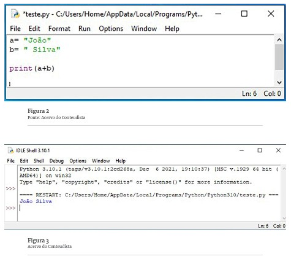
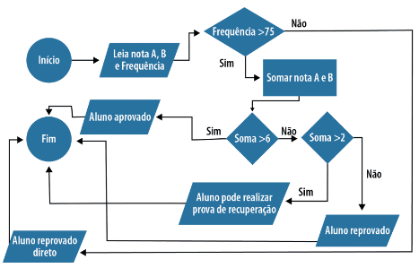

# Operadores e Estruturas de Decisão em Python

Este é um documento de referência sobre operadores e estruturas de decisão em Python, incluindo uma explanação sobre cada tipo de operador e exemplos práticos de uso.

## Operadores

Um operador é um símbolo que informa ao programa quais manipulações matemáticas ou lógicas ele deve executar. Em Python, existem diferentes tipos de operadores:

### Operadores Aritméticos

Os operadores aritméticos são utilizados para elaboração e execução de cálculos matemáticos. Em Python, os operadores aritméticos são:

| Operador | Descrição          | Exemplo                 |
|----------|--------------------|-------------------------|
| +        | Adição             | MinhaVariavel = 2 + 4   |
| -        | Subtração          | MinhaVariavel = 2 - 4   |
| *        | Multiplicação      | MinhaVariavel = 2 * 4   |
| /        | Divisão            | MinhaVariavel = 4 / 2   |
| %        | Módulo             | MinhaVariavel = 8 % 2   |
| **       | Exponenciação      | MinhaVariavel = 2 ** 4  |
| //       | Divisão Inteira    | MinhaVariavel = 9 // 2  |

### Exemplos de Utilização dos Operadores Aritméticos(operadores.py)

```python
a = 2
b = 3

resultado = a + b
print(resultado)  # Saída: 5

resultado = a - b
print(resultado)  # Saída: -1

resultado = a * b
print(resultado)  # Saída: 6

resultado = a / b
print(resultado)  # Saída: 0.6666

resultado = a ** b
print(resultado)  # Saída: 8

resultado = a // b
print(resultado)  # Saída: 0
```

### Precedência de Operadores Aritméticos

Em Python, a precedência dos operadores determina a ordem de avaliação de uma expressão. Os operadores aritméticos seguem a seguinte ordem de precedência:

1. Parênteses ()
2. Exponenciação **
3. Multiplicação *, Divisão /, Módulo %, Divisão Inteira //
4. Adição +, Subtração -

Em uma expressão com operadores da mesma prioridade, as operações são executadas da esquerda para a direita.

## Operadores Relacionais(operadores_relacionais.py)

Os operadores relacionais são utilizados para comparar valores entre termos. Em Python, os operadores relacionais são:

| Operador | Nome        | Descrição                                                   | Exemplo                                |
|----------|-------------|-------------------------------------------------------------|----------------------------------------|
| ==       | Igualdade   | Verifica se os valores de dois operandos são iguais        | if(a == b):                            |
| !=       | Diferente   | Verifica se os valores de dois operandos são diferentes     | if(a != b):                            |
| >        | Maior que   | Verifica se o valor do operando esquerdo é maior            | if(a > b):                             |
| <        | Menor que   | Verifica se o valor do operando esquerdo é menor            | if(a < b):                             |
| >=       | Maior igual | Verifica se o valor do operando esquerdo é maior ou igual   | if(a >= b):                            |
| <=       | Menor igual | Verifica se o valor do operando esquerdo é menor ou igual   | if(a <= b):                            |

## Operadores Lógicos(Operadores_logicos.py)

Os operadores lógicos são utilizados para combinar expressões condicionais e retornar um valor booleano. Em Python, os operadores lógicos são:

| Operador | Descrição                                              | Exemplo                                    |
|----------|--------------------------------------------------------|--------------------------------------------|
| and      | Retorna verdadeiro se ambas as expressões forem verdadeiras | if(a >= b) and (c > d):                    |
| or       | Retorna verdadeiro se pelo menos uma das expressões for verdadeira | if(a >= b) or (c > d):                 |
| not      | Retorna verdadeiro se a expressão for avaliada como falsa | a, b = 10, 5<br>if not (a < b):          |

## Operadores de Concatenação

O operador de concatenação de string em Python é representado pelo símbolo "+" e é utilizado para unir duas strings.

### Exemplo de Utilização do Operador de Concatenação

```python
texto1 = "Olá, "
texto2 = "mundo!"

mensagem = texto1 + texto2
print(mensagem)  # Saída: Olá, mundo!
```

## Estruturas de Decisão em Python

As estruturas de decisão permitem que um programa execute diferentes ações com base em condições específicas.

### Estrutura if ...

A estrutura `if` é utilizada para testar uma condição e, caso ela seja verdadeira, executa um bloco de instruções.

```python
a = 2
b = 3

if a > b:
    print("a é maior que b")
```

### Estrutura if ... else

A estrutura `if ... else` é utilizada para testar uma condição e, caso ela seja verdadeira, executa um bloco de instruções. Caso contrário, executa outro bloco de instruções.

```python
a = 2
b = 3

if a > b:
    print("a é maior que b")
else:
    print("a não é maior que b")
```

### Estrutura if ... elif

A estrutura `if ... elif` é utilizada quando múltiplas condições precisam ser testadas em sequência. Quando uma condição é verdadeira, o bloco de instruções correspondente é executado e as demais condições não são verificadas.

```python
a = 2

if a == 1:
    print("a é igual a 1")
elif a == 2:
    print("a é igual a 2")
else:
    print("a é diferente de 1 e 2")
```

### Estruturas de Decisão Encadeadas

As estruturas de decisão encadeadas permitem a execução de diferentes blocos de instruções com base em múltiplas condições.

```python
a = 2
b = 3

if a > b:
    if b > 1:
        print("a é maior que b e b é maior que 1")
else:
    if a == 2:
        print("a é igual a 2 e b é menor ou igual a 1")
    else:
        print("a é menor que b")
``

`

Estas são as principais informações sobre operadores e estruturas de decisão em Python. Espero que este documento seja útil para sua compreensão e prática da linguagem Python.

## Estruturas de Decisão Encadeadas

Em alguns cenários de nossos algoritmos, devem-se realizar diversos testes e condições para se atingir um objetivo. Em cenários onde é preciso verificar diversas condições, podemos escrever sequências de instruções de estruturas de decisão. Esse cenário comumente é chamado de estruturas de decisão aninhadas ou encadeadas.

Abaixo, temos exemplos de estruturas de decisão encadeadas.

```python
if(condição): 
    bloco de instrução 1
elif(condição):
    bloco de instrução 2
else:
    bloco de instrução 3
else:
    bloco de instrução 4
```

```python
if(condição): 
    if(condição):
        bloco de instrução 1
    else:
        if(condição):
            bloco de instrução 2
        else:
            bloco de instrução 3
else:
    bloco de instrução 4
```

Vejamos o seguinte cenário. Um programa deve obter as notas A e B e a frequência de um aluno. Para ser considerado aprovado, o aluno deve possuir frequência maior que 75% e nota maior que 6. 

Caso o aluno não possua frequência maior que 75%, será considerado reprovado de forma direta. 

O aluno que possuir a frequência mínima, porém, nota menor ou igual a 6 e maior que 2, poderá realizar uma prova de recuperação, caso contrário, será reprovado. A seguir, temos um fluxograma descrevendo esse algoritmo.



Implementando o seguinte algoritmo em Python, temos:

```python
a = 2
b = 5
frequencia = 80

if frequencia > 75:
    soma = a + b
    if soma > 6:
        print("Aluno aprovado")
    elif soma > 2:
        print("Aluno pode realizar prova de recuperação")
    else:
        print("Aluno reprovado")
else:
    print("Aluno reprovado direto")
```

Explicando o Código

- Linhas 1 e 2: declaramos uma variável com o nome de “a” e “b” e, em seguida, atribuímos os valores 1 para “a” e 5 para “b”;
- Linha 5: descrevemos a estrutura condicional if testando a condição “frequencia > 75”. Caso o teste retorne verdadeiro, o programa executará o bloco a partir da linha 6. Caso contrário, o programa executará o bloco de instruções a partir da linha 13 e finalizará a execução do programa;
- Linha 6: efetuamos uma operação de adição entre as variáveis “a” e “b” e atribuímos o resultado para a variável “soma”;
- Linha 7: descrevemos a estrutura condicional if testando a condição “soma > 6”. Caso o teste retorne verdadeiro, o programa executará a linha 8. Caso contrário, o programa executará a linha 9;
- Linha 8: utilizamos a função “print” para imprimir na tela o texto “Aluno aprovado”;
- Linha 9: testamos a condição “soma > 2”. Caso o teste retorne verdadeiro, o programa executará a linha 10. Caso contrário, o programa irá executar o bloco de instruções a partir da linha 12;
- Linha 10: utilizamos a função “print” para imprimir na tela o texto “Aluno pode realizar prova de recuperação”;
- Linha 12: utilizamos a função “print” para imprimir na tela o texto “Aluno reprovado”;
- Linha 13: utilizamos a função “print” para imprimir na tela o texto “Aluno reprovado direto”.

### Em Síntese

Nesta Unidade, estudamos a aplicação de operadores (aritméticos, relacionais, lógicos e de concatenação), bem como os conceitos de estruturas de decisão. É importante que assista à videoaula e que leia os livros e materiais complementares indicados nesta unidade de estudo. É fundamental que, além dos estudos em Python, busque estudar ou retomar conceitos de desenvolvimento de algoritmos, ter uma boa noção desse tema o ajudará na jornada de estudos de programação de computadores.
